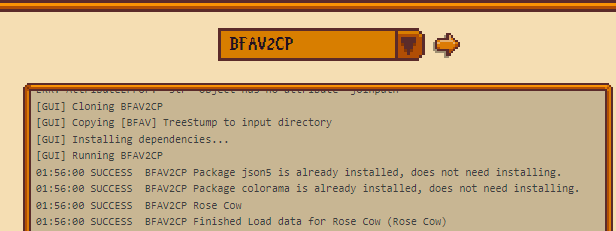
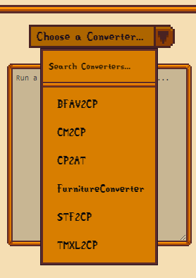
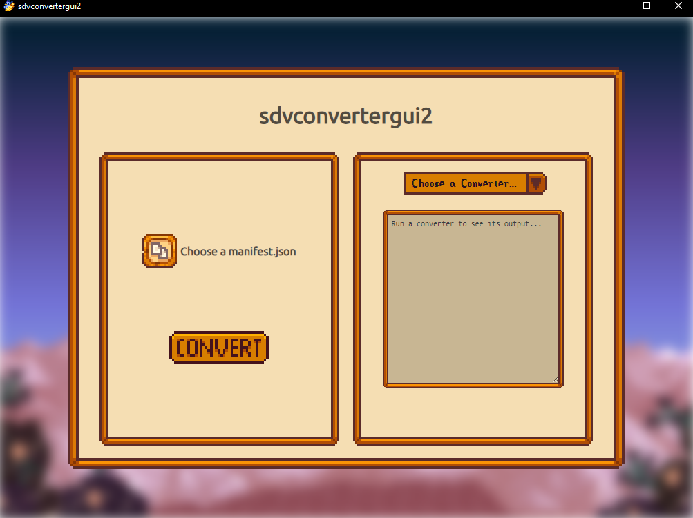
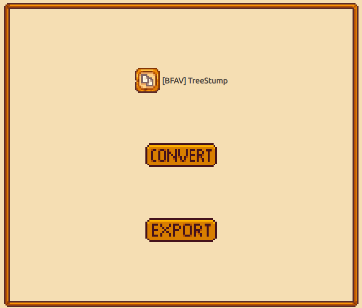

    <image src="readme-assets/icon-256x.png">
    <h1>sdvconvertergui2</h1>

 

A rewritten GUI for popular Stardew Valley converters.

## Installation

It's a portable application (as of now) - there's no installer.

## Usage

1. Download the latest release from [the NexusMods page](https://www.nexusmods.com/stardewvalley/mods/20986?tab=files).
2. Run the downloaded file.
3. Choose a converter and select a `manifest.json` (that works with the converter)
4. Press the convert button and wait for it to complete.
5. Your converted mod with be opened in your file manager, and you can press the export button to see a zipped version.

## Why no Mac & Linux releases?

I could not find portable Python and Git releases for them.

## Supported converters

- [BFAV2CP](https://github.com/AnotherPillow/BFAV2CP) by AnotherPillow
- [TMXL2CP](https://github.com/AnotherPillow/TMXL2CP) by AnotherPillow
- [CM2CP](https://github.com/AnotherPillow/CM2CP) by AnotherPillow
- [STF2CP](https://github.com/AnotherPillow/STF2CP) by AnotherPillow
- [FurnitureConverter](https://github.com/elizabethcd/FurnitureConverter) by elizabethcd
- [SkirtConverter](https://github.com/elizabethcd/SkirtConverter) by elizabethcd
- [CP2AT](https://github.com/holy-the-sea/CP2AT) by holy-the-sea

## Attribution

All converters are used with permission, and the original authors can be found above.

## Images

